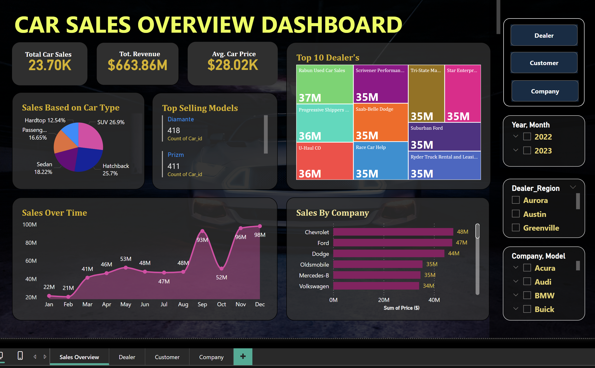
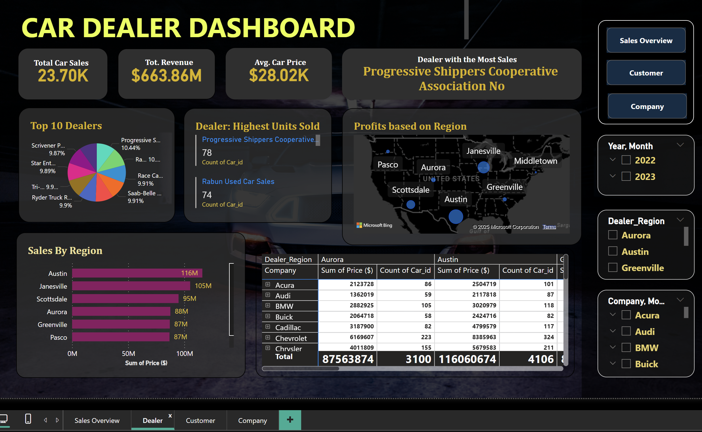
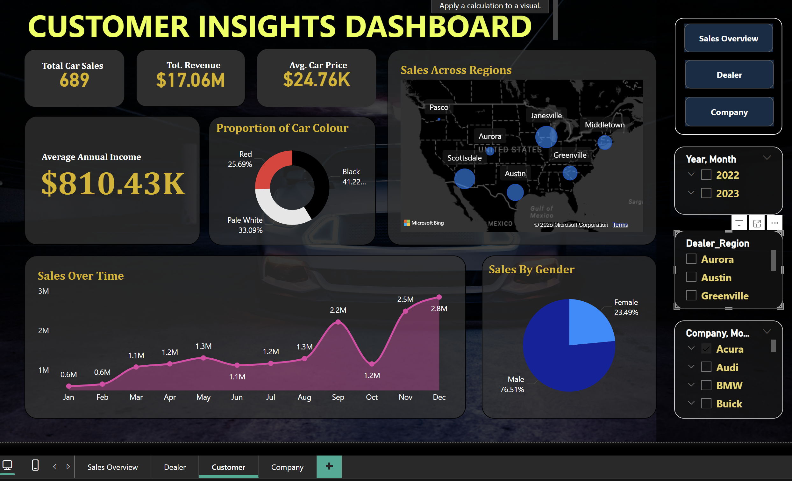
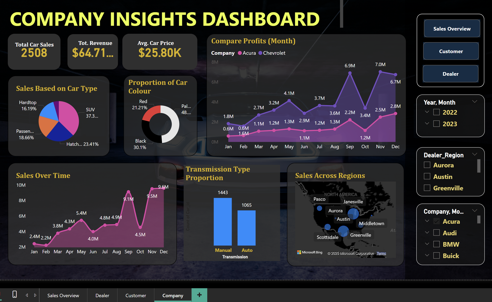

# Car Sales Data Analysis - Power BI Dashboards

This repository contains Power BI dashboards analyzing car sales data.  Four dashboards have been created to provide different perspectives on sales performance:

## Dashboards

### 1. Sales Overview

This dashboard provides a comprehensive view of overall car sales performance.  It tracks key metrics like total sales, total revenue, and average car price, offering insights into the overall financial health of the business.  The dashboard also breaks down sales by car type and highlights the top-selling models, enabling users to understand product performance and customer preferences.  Furthermore, it visualizes sales trends over time and compares sales performance across different companies, facilitating analysis of market dynamics and competitive landscape.

**Key Metrics:**

* **Total Car Sales:** 23.70K
* **Total Revenue:** $663.86M
* **Average Car Price:** $28.02K

**Visualizations and Insights:**

* **Sales Based on Car Type:** A pie chart illustrating the distribution of sales across different car types (Hardtop, SUV, Passenger, Sedan, Hatchback).  This allows for quick identification of the most popular car categories.
* **Top Selling Models:** Displays the top-selling car models, providing insights into customer preferences and market trends.  Includes the count of each model sold (Diamante - 418, Prizm - 411).
* **Sales Over Time:** A line chart depicting sales trends over a period (presumably monthly).  This visualization helps identify seasonal patterns and growth trajectories.
* **Sales By Company:** A bar chart comparing sales performance across different car companies (Chevrolet, Ford, Dodge, Oldsmobile, Mercedes-Benz, Volkswagen).  This allows for benchmarking and competitive analysis.
* **Top 10 Dealer's:**  Shows the top-performing dealers, ranked by sales volume.  This highlights successful dealerships and potentially reveals best practices.
* **Dealer Region:**  Categorizes sales by region (Aurora, Austin, Greenville), allowing for geographic performance analysis.
* **Year, Month:** Filtering options for Year (2022, 2023) and Month allow users to drill down into specific time periods for more granular analysis.
* **Company, Model:** Filtering options for Company and Model offer further segmentation for detailed analysis of specific products and brands.

**Filters and Interactivity:**

The dashboard includes interactive elements such as filters for Year, Month, Company, and Model, enabling users to explore the data from various perspectives and focus on specific segments of interest.  The "Dealer" and "Customer" buttons providing navigation to separate, more detailed dashboards focused on those specific areas.

### 2. Dealer Dashboard

This dashboard focuses on providing detailed insights into dealer performance, profitability, and sales distribution across different regions.  It highlights key metrics such as total car sales, total revenue, and average car price, offering a high-level overview of the overall sales landscape.  The dashboard also showcases the top-performing dealers, identifies the dealer with the most sales, and analyzes profits based on region.  Furthermore, it breaks down sales by region, providing a granular view of geographic performance.

**Key Metrics:**

* **Total Car Sales:** 23.70K
* **Total Revenue:** $663.86M
* **Average Car Price:** $28.02K

**Visualizations and Insights:**

* **Top 10 Dealers:** A bar chart ranking the top 10 dealers based on an unspecified metric (likely sales volume or revenue).  This visualization helps identify high-performing dealerships and understand their contribution to overall sales.
* **Dealer with the Most Sales:** Highlights the top-performing dealer (Progressive Shippers Cooperative Association No) and their percentage contribution (10.44%).
* **Dealer: Highest Units Sold:**  Identifies the dealer who sold the most units (Progressive Shippers Cooperative) and the specific car models contributing to their high sales volume (78 units of unspecified model, 74 units of another model).
* **Profits Based on Region:** A map of the United States displaying profit distribution across different regions (Pasco, Janesville, Middletown, Scottsdale, Aurora, Greenville, Austin). The map allows for quick visual identification of profitable areas.
* **Sales By Region:** A bar chart comparing sales performance across different regions (Austin, Janesville, Scottsdale, Aurora, Greenville, Pasco). This visualization allows for easy comparison of regional sales volumes.
* **Dealer Region Table:** A detailed table providing a breakdown of sales data for each region, including the sum of prices and count of car IDs for various companies (Acura, Audi, BMW, Buick, Cadillac, Chevrolet, Chrysler).  This table offers granular insights into regional sales performance by brand.

**Filters and Interactivity:**

* **Year, Month:** Filtering options for Year (2022, 2023) and Month allow users to drill down into specific time periods for more granular analysis.
* **Dealer Region:** Checkboxes allow users to select specific regions for focused analysis (Aurora, Austin, Greenville).
* **Company, Model:** Filtering options for Company and Model offer further segmentation for detailed analysis of specific products and brands.

**Observations:**

* Progressive Shippers Cooperative appears to be a top performer in terms of both sales volume and the number of units sold.
* The "Dealer: Highest Units Sold" section suggests a focus on specific car models or types driving sales for top dealers.
* The "Profits Based on Region" map, while visually appealing, might benefit from clearer labeling or tooltips to indicate profit values for each region.
* The "Dealer Region" table provides detailed data but could be improved with better formatting or sorting options.

### 3. Customer Sales Dashboard

This dashboard provides insights into customer demographics, preferences, and purchasing behavior. It analyzes key metrics such as total car sales, total revenue, and average car price, offering a high-level view of customer-related sales performance. The dashboard also explores customer income levels, preferred car colors, regional sales distribution, sales trends over time, and sales by gender.

**Key Metrics:**

* **Total Car Sales:** 689
* **Total Revenue:** $17.06M
* **Average Car Price:** $24.76K
* **Average Annual Income:** $810.43K

**Visualizations and Insights:**

* **Sales Across Regions:** A map of the United States displaying sales distribution across different regions (Pasco, Janesville, Middletown, Aurora, Scottsdale, Greenville, Austin). This visualization allows for quick identification of areas with high or low sales activity.
* **Proportion of Car Colour:** A pie chart showing the distribution of preferred car colors among customers (Red, Black, Pale White). This helps understand customer preferences for vehicle aesthetics.
* **Sales Over Time:** A line chart depicting sales trends over a period.  This visualization helps identify seasonal patterns and growth trajectories.
* **Sales By Gender:** A pie chart illustrating the proportion of sales attributed to different genders (Female, Male). This helps understand the gender distribution of car buyers.

**Filters and Interactivity:**

* **Year, Month:** Filtering options for Year (2022, 2023) and Month allow users to drill down into specific time periods for more granular analysis.
* **Dealer Region:** Checkboxes allow users to select specific regions for focused analysis (Aurora, Austin, Greenville).
* **Company, Model:** Filtering options for Company and Model offer further segmentation for detailed analysis of specific products and brands.

**Observations:**

* Black appears to be the most popular car color among customers, followed by Pale White and then Red.
* The average annual income of customers is relatively high ($810.43K), suggesting a focus on a higher-income demographic.
* The "Sales Over Time" chart shows fluctuations in sales, potentially indicating seasonal trends or the impact of external factors.
* The majority of sales are attributed to male customers (76.51%), compared to 23.49% for female customers.

### 4. Company Sales Dashboard

This dashboard offers a comprehensive view of the company's overall sales performance. It aggregates data from all dealers and provides insights into overall sales trends, market share, and product performance.

* **Key Metrics:** Total Sales, Sales Growth, Market Share, Product Performance, Profit Margins (if available).
* **Visualizations:** Charts showing overall sales trends, comparisons of product performance, KPIs summarizing key company metrics.

## Data Source

The data used for these dashboards is a publicly available car sales dataset. 